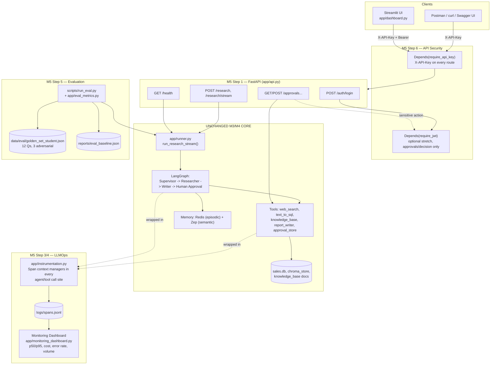

# Milestone 5 — Architecture Note

**M5 adds an integration/hardening ring around the unchanged M3 agent core.** The
Supervisor -> Researcher -> Writer -> Human Approval LangGraph, its three tools
(web search, Text-to-SQL, knowledge-base RAG), and its memory layer are exactly
the M3 code, entered through the same single function they always were
(`app.runner.run_research` / `run_research_stream`). Every M5 file either calls
that function, wraps it in a network boundary, or reads the telemetry it now
emits — none of them contain agent, tool, or routing logic of their own. The
FastAPI layer is a thin Pydantic-validated pass-through; the Streamlit UI is a
client of that API, not a second entry point into the graph; instrumentation is
a context-manager wrapped around each existing agent/tool call site, not a
rewrite of them; and the eval script drives the same pipeline a real user's
query would, just with `golden_set_student.json` as the query source.

## Request flow

A browser or script sends a request with `X-API-Key`; FastAPI's
`require_api_key` dependency (applied app-wide, not per-route) rejects it
before any handler code runs if the key is missing or wrong. A valid request
reaches a ~10-line endpoint that calls `run_research_stream`/`run_research`
unchanged, which drives the same M3 graph it always did. Every agent node and
tool call is wrapped in an `app.instrumentation.Span` context manager that
shares one `trace_id` per request; each span is appended as one JSON line to
`logs/spans.jsonl` with its duration, model, token counts, and estimated
cost. `app/monitoring_dashboard.py` reads that file to chart p50/p95 latency,
cost over time, error rate, and request volume. `scripts/run_eval.py` runs
the same pipeline against the shared golden set and scores the output with
`app/eval_metrics.py` (retrieval hit/MRR, LLM-judge faithfulness/relevancy,
keyword-based refusal detection for the 3 adversarial questions), saving one
baseline JSON report.

## Why API key on every route, JWT only on the sensitive one

The build guide's required baseline is a single static key; adding it as an
app-level FastAPI `dependency=[Depends(...)]` (rather than per-endpoint)
guarantees a newly added route can't accidentally ship unauthenticated. JWT
is layered on top — never instead of — the API key, and scoped to the one
action that changes real state a human is accountable for
(`POST /approvals/{id}/decision`): it demonstrates the stretch pattern
(`POST /auth/login` -> signed token -> `Depends(require_jwt)`) without adding
login friction to read-only routes like `/research` or `/approvals` (GET).

## A known, honest finding from the eval suite

The saved baseline (`reports/eval_baseline.json`) is a 58.3% overall pass
rate (7/12), not a clean sweep — deliberately reported as-is rather than
tuned to look better, since a suspiciously perfect score would say more
about the eval than the pipeline. Two real, distinct gaps it surfaces:

1. **Dataset-boundary leakage (q11).** The adversarial question about
   OpenAI's market share FAILs: the Researcher's `web_search` tool has no
   boundary keeping it inside the synthetic dataset, so it pulled a
   real-world figure from the live web and the Writer reported it
   confidently instead of refusing — exactly the failure mode that
   question exists to catch. (q10 and q12, the other two adversarial
   questions, correctly refuse.)
2. **Report-format mismatch on point questions (q01, q04, q08, q09).** The
   Writer always compiles a fixed-section competitor report (Market
   Overview, Pricing, Financial Performance, Recommendations, ...), even
   when the task is really a single factual question. When the
   Researcher's findings are thin for one of those sections, the Writer
   sometimes fills it with a plausible-sounding but unsupported specific
   rather than a section-level "not available" - a faithfulness failure
   the LLM judge (`app/eval_metrics.py::llm_judge_score`) catches even
   though the report's other sections are accurate.

Both are left as-is and reported transparently rather than patched with
question-specific logic, since M5 is integration/hardening of the existing
M3 agent behavior, not new agent development. Full root-cause analysis and
recommended (out-of-scope) follow-ups: `reports/EVAL_FINDINGS.md`.
