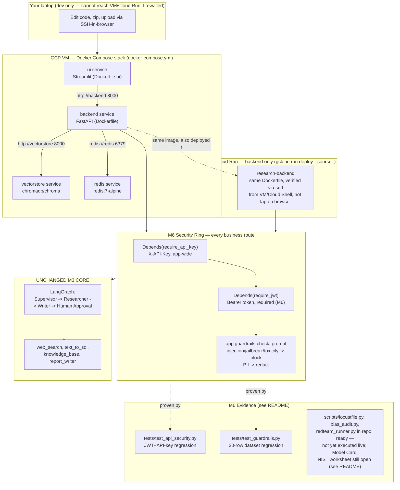

# Milestone 6 — Production Architecture Note

**M6 wraps the unchanged M3 core and M5 API/UI/observability ring in a
deployment, security-hardening, and governance ring — it adds no new
agents, tools, or routing logic.** The Supervisor → Researcher → Writer →
Human Approval graph is exactly M3's; the FastAPI/Streamlit split and the
LLMOps instrumentation are exactly M5's. What's new: the whole stack now
comes up as four Docker Compose services instead of three manually-ordered
terminals; the FastAPI backend also deploys standalone to Cloud Run behind
a real URL; every business request now passes two required auth checks
(API key *and* JWT, not either/or) and a prompt-injection/jailbreak/PII
guardrail (ported and strengthened from M4) before it ever reaches the
graph; and the whole thing ships with the deployment/security evidence a
production sign-off actually asks for, instead of a claim that it works.

## Why only the backend goes to Cloud Run

The API is the stateless layer — it holds no data of its own between
requests, so it's the one piece that actually benefits from Cloud Run's
scale-to-zero model. The vector store is stateful (an index that takes
real embedding calls to rebuild) and the Streamlit UI is an internal ops
tool, not a public-facing service; both stay on the VM's Compose stack
where they're cheaper to keep running and don't need to survive traffic
spikes from strangers. This mirrors a real production pattern: serverless
for the request-handling tier, persistent infra for stateful/internal
pieces.

## Why the load test targets the VM, not Cloud Run

The VM is already a sunk cost for the rest of the program regardless of
this milestone, so testing against it costs nothing extra. Cloud Run
bills per request/CPU-second; pointing a 500-concurrent-user Locust burst
at it would burn real, avoidable money out of a ~$10 total remaining
budget for a number that (per the Locust step) is not even meant to be
Cloud-Run-representative — see `DEPLOY.md`.
